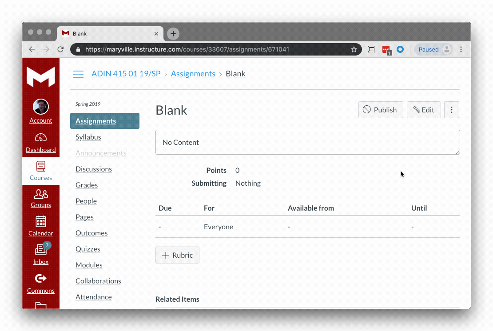

# Canvas-CSS
Maryville Design & Visual Art Program's CSS files for Canvas CMS  

## Set Up
Just follow these steps to enable:
1. In Canvas, edit the content in html mode.
2. Add a surrounding div element around all the content with the class, dva.

  ```html
    <div class="dva">
      <!-- all of the content goes inside here  -->
    </div>
  ```
 

3. Make sure all your content is inside this div.
    
## The Options
 
### Banners
```html
<h2 class="icon-h lesson">Lessons</h2>
<h2 class="icon-h project">Project</h2>
<h2 class="icon-h quiz">Quiz</h2>
<h2 class="icon-h post">Post</h2>
<h2 class="icon-h reply">Reply</h2>
<h2 class="icon-h respond">Respond</h2>
<h2 class="icon-h objective">Objectives & Outcomes</h2>
<h2 class="icon-h task">Task</h2>
<h2 class="icon-h submit">Submit</h2>
<h2 class="icon-h requirement">Requirements</h2>
<h2 class="icon-h assignment">Assignments</h2>
<h2 class="icon-h reading">Readings</h2>
```
### Full Bleed Video
```html
<div class="video">
    <iframe 
    src="https://www.youtube.com/embed/_Mz228aUzq8" 
    frameborder="0" 
    allowfullscreen>
    </iframe>
</div>
```

### Tip Good Bad Table
```html
<table class="tbg">
  <tr>
    <th>Tip</th>
    <th>Bad Example</th> 
    <th>Good Example</th>
  </tr>
  <tr>
    <td>column 1 row 2</td>
    <td>column 2 row 2</td> 
    <td>column 3 row 3</td>
  </tr>
  <tr>
    <td>column 1 row 3</td>
    <td>column 2 row 3</td> 
    <td>column 3 row 3</td>
  </tr>
</table>
```

